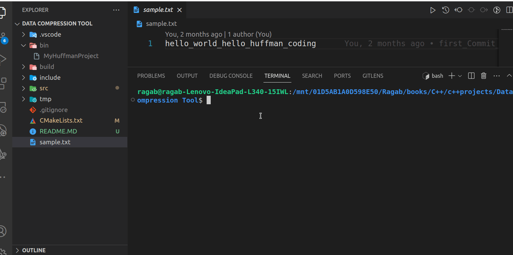

# Huffman Coding Project
<!--
-->
<kbd></kbd>
## Description
This is a C++ project that demonstrates data compression and decompression using the Huffman coding algorithm. Huffman coding is a widely used method for lossless data compression, often utilized in file compression tools, data transmission, and various applications where efficient data storage is essential.

## Features
- **Data Compression**: Compresses text data using Huffman coding, resulting in a shorter binary representation.
- **Data Decompression**: Decompresses data that has been previously compressed using the Huffman algorithm.
- **File Input/Output**: Allows you to compress and decompress text data stored in files.
- **Huffman Tree Generation**: Builds Huffman trees based on the frequency of characters in the input data.
- **Huffman Codes**: Generates Huffman codes for each character in the input data.
- **Command-Line Interface**: Provides a simple command-line interface for compressing and decompressing files.

## Technology Stack
- **C++**: The project is written in C++ to implement the Huffman coding algorithm and handle file input/output.
- **CMake**: CMake is used for building the project.
- **GitHub**: The project is hosted on GitHub for version control.

## Getting Started
Follow the steps below to use and build the project:

1. Clone the repository:
   ```sh
   git clone https://github.com/yourusername/huffman-coding.git
   ```

2. Build the project using CMake:
   ```sh
   mkdir build
   cd build
   cmake ..
   make
   ```

3. Run the executable:
   - For compression:
     ```sh
     ./MyHuffmanProject
     ```

   - For decompression:
     ```sh
     ./MyHuffmanProject
     ```

## Usage
- **Compress Data**: Use the program to compress text data and generate compressed files.
- **Decompress Data**: Use the program to decompress previously compressed files.
- **Customization**: You can modify the code to suit your specific needs, such as customizing compression/decompression behavior.

## Examples
1. To compress a file:
   ```sh
   ./bin/MyHuffmanProject
   ```

2. To decompress a file:
   ```sh
   ./bin/MyHuffmanProject
   ```

